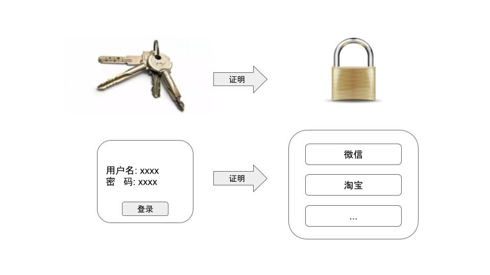

# 我为什么执着于个人数据
sun

开篇，我想拿出我常想的一个问题？你如何证明你是你，而不是别人冒充的你。
简单来说，在现实世界，我可以设置一个只有我的钥匙才能打开的锁，想要证明的时候，我只要拿出钥匙，打开锁，那么别人就可以验证是我本人了。如果是在网络服务中，如何证明自己呢？目前普遍的方案都是用户名和密码。

这种方案确实可以保证第三方无法伪造自己，但是有个致命的问题却是：无法保证服务提供方伪造自己。举个例子，如果有人从微信后台用你的帐号给你的好朋友发了一条消息，那么你的好朋友能否判断出这个消息是你自己发送的还是微信后台发送的？更进一步，如果微信后台有个人工智能AI， 那么AI是否可以收集你的聊天记录，声音记录，视频记录，然后模仿你的行为习惯，面容面貌，以此来和你的朋友聊天，那么这个时候，你自己还有意义嘛？一个虚拟的你，已经活在你朋友的脑中了，他们已经无法判断哪个才是真的你。

当自己的行为社交，衣食住行都被巨头们记录下来之后，可以想的极端一些，巨头们是不是可以再造一个“你”，然后把真正的你抹杀掉，那么是不是就没人能够知道你已经消失了。

不知何时，我开始意识到个人数据长期被巨头们垄断，并不停侵犯。以前个人数据泄漏，往往最终都会怪罪于以非法手段获取信息的骇客，而近些年，责怪的对象则变成了导致泄漏的企业。不知道这种变化的背后，是不是因为，早期各个企业对于个人数据并不是特别敏感，并没有想着拿这些数据干些什么，而现在随着大数据和AI的发展，对于数据的需求越来越大，一些企业就开始铤而走险，让这些个人数据流动起来，一旦流动，就可能被追踪，就可能被发现。这其中就包括Facebook这种级别的企业。

18年的时候，我们几个小伙伴进行了一系列的头脑风暴般，想要找寻如何保护自己的数据呢，但是当时精力和知识积累都不足，我们只能在意识层面不断完善保护个人数据的想法，直到19年，当我们设计的TDN大体实现的时候，才开始设计一款如何保证个人数据不被窃取，不被滥用的实现方案，最初的想法只是设计一款软件，基于许可式的区块链形式，将个人的所有设备都连到一起，然后再各个设备上收集到的信息，可以实时的同步到其他设备中，这样，我们只需要其中任一个设备，就可以得到所有设备收集到的信息，这样设备，可以是手机，电脑，也可以是家中的智能设备，自己的数据中心。它和目前其他的个人数据中心，比如小米啊，苹果之类的云端数据，最大的区别就是，后者这些平台都是中心化控制的，自己的数据均被上传到这些数据中心，我们必须无条件相信这些数据中心，不会窃取和利用我们的数据，因为我们没有任何办法去监督。

后面发现单纯的这种连接的意义还不够，还得将这些设备用起来，所以有了应用共享的念头，意思就是，只要其中一个设备安装了某个应用，其他设备均可以控制这个应用，不再单单是数据共享的作用了，这样看起来，这个软件就很像是一个运行平台了，可以在上面安装各种各样的应用，不管是DApp，还是中心化的App都可以运行。这个时候也就有了两种形态，一种是各种App以独立的方式安装到用户的设备上，可以单独打开和独立运行，通过rpc的形式与我们的软件沟通，获取和保存数据。还有一种就是以轻应用的形态出现，类比于小程序，运行在我们的软件中，不需要独立安装，通过虚拟机的调用来和我们的软件相沟通。

前几天给这种设计方案取了个名字，叫做 Assassin，中文是刺客的意思。隐匿，安全，高效。借助TDN，assassin可以借助其他暴露在公网环境下的p2p连接节点，安全，隐匿的进行代理穿透和传输。

目前，个人数据和隐私保护越来越被人们所接受和追求，在讨论数据保护这个概念和思想的时候，我们也愿意做一些实践尝试来探索，这就是Assassin的由来，一款基于Chamomile和TDN构建的只属于我们自己的个人分布式数据助手。

官网：cypherlink.io
开源：github.com/cypherlink

